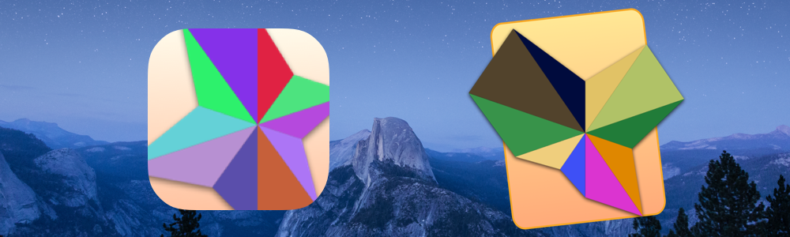

# SSChartwell  

SSChartwell is a light weight charting framework intended for use by designers and developers used to prototyping with the amazing FFChartwell font.

## License

SSChartwell is released under the [MIT License](LICENSE.md).