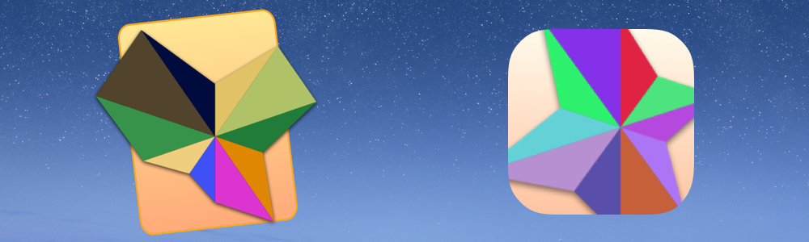
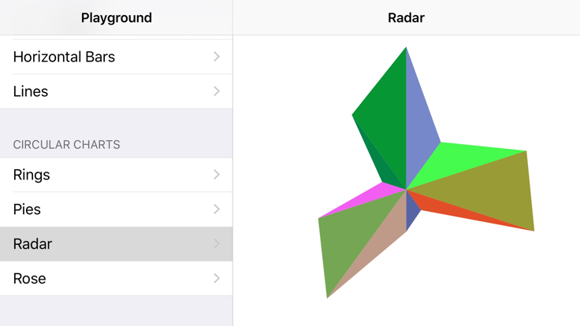

# SSChartwell [](https://raw.githubusercontent.com/Carthage/Carthage/master/LICENSE.md) [](https://github.com/Carthage/Carthage)

SSChartwell is a light weight charting framework written in Swift. It was written for designers that are used to working with [FFChartwell](https://www.fontfont.com/how-to-use-ff-chartwell). This framework makes interacting with FFChartwell in apps simple and type safe. SSChartwell makes it very simple to generate UIImage and NSImage of charts that can be used anywhere those types are supported in Cocoa and Cocoa Touch (almost everywhere). On iOS, SSChartwell can even generate animated images so you can build in your charts.

## How it works (Basic Types)

- **ChartDataType:** This is the core type. Each of the supported FFChartwell Fonts has a ChartDataType. You initialize a data type with an array of components. Once initialized, the chart data is safe and protected by Swift’s mutability system.
- **ChartDataComponentType:** Each FFChartwell Font has a ComponentType. The components make up the data that is shown in the chart. Different Fonts have different component types with different max values.
- **ChartRendererType:** The above two types are just data types. The renderer is what actually turns that data into UIImage/NSImage for use in your UI. The renderer type is initialized with the ChartDataType. The renderer type checks if the needed FFChartwell Font is in the system or in your app’s bundle. If not, then the renderer does not initialize.
- **Note:** FFChartwell is copyrighted and is not part of this open source project. You must provide your own copy of the FFChartwell fonts you wish to you use as part of your app bundle.

## What It Does

### 1) Immutable Chart Data Storage
- All of the chart types are structs. So they are protected by Swift immutability system. You can safely create charts, store them in arrays, move them around your app and there is no chance they get modified along the way.
- Then, right at the end, you can create a Renderer and create the image you display in the UI.
- Optionally, you could write extensions that allow the chart types to be serialized to disk via NSPropertyListSerialization

### 2) Resolution Independent Chart Images
- Since FFChartwell is a font, SSChartwell uses CoreText and the built in Cocoa concepts for rendering charts at any font size you wish.
- SSChartwell uses UILabel/NSTextField and NSAttributedString to render the charts using iOS and OSX’s fantastic rendering capabilities. The results are really fantastic.



[Radar Chart](zzScreenshots/Radar.jpg) 
- [Rose Chart](zzScreenshots/Rose.jpg) 
- [Rings Chart](zzScreenshots/Rings.jpg) 
- [Pies Chart](zzScreenshots/Pies.jpg) 
- [Lines Chart](zzScreenshots/Lines.jpg) 
- [Horizontal Bars Chart](zzScreenshots/Bars.jpg) 
- [Vertical Bars Chart](zzScreenshots/BarsVertical.jpg)

### 3) Animated Charts (iOS Only)
UIImageView supports animation. All you have to do is populate its ```animatedImages``` property with an array of UIImages. The Rendered in SSChartwell is able to generate an array of UIImages for you. You just have to choose the number of frames you want.

``` swift
func generateAnimatedImagesWithFrameCount(frameCount: Uint, completionHandler: ([UIImage] -> Void))
```

## How to Use

1. [Buy FFChartwell](https://www.fontfont.com/how-to-use-ff-chartwell#intro) - It is not included with this project.
1. Add the fonts you would like into your app’s bundle.
1. Add github “jeffreybergier/SwiftSwiftChartwell” to your Cartfile
1. Do the usual carthage work to get the frameworks into your project.
1. import SSChartwell_iOS / SSChartwell_macOS / SSChartwell_tvOS
1. Use code samples below to generate an image.

### iOS
```swift
let pieData: [ChartDataComponentType] = [
	Chart.Pies.Component(value: 20, color: UIColor.redColor().CGColor),
	Chart.Pies.Component(value: 35, color: UIColor.blueColor().CGColor),
	Chart.Pies.Component(value: 25, color: UIColor.greenColor().CGColor)
]
            
if let pieChart = Chart.Pies(components: pieData) {
	let pieRenderer = Chart.Renderer(data: pieChart, fontSize: 50)
	let pieImage = pieRenderer?.image
}
```
### OS X
```swift
let ringData: [ChartDataComponentType] = [
	Chart.Rings.Component(value: 75, color: NSColor.redColor().CGColor),
	Chart.Rings.Component(value: 65, color: NSColor.blueColor().CGColor),
	Chart.Rings.Component(value: 25, color: NSColor.greenColor().CGColor)
]
            
if let ringChart = Chart.Rings(components: ringData) {
	let ringRenderer = Chart.Renderer(data: ringChart, fontSize: 50)
	let ringImage = pieRenderer?.image
}
```

## Why Did I Make This?
- I am a designer and I use FFChartwell in my mockups. I thought it would be useful to be able to more easily transfer these mockups into Xcode prototypes.
- Also, I find the charting frameworks for iOS to be pretty heavy and unwieldy. I like how this framework just returns a UIImage that I can display in the UI. Nothing scary. No custom drawing, etc.
- Lastly, I wanted to learn. I heavily used Protocol Extensions for this project. Each of the chart types is a totally empty Struct. All it does is conform to the ChartDataType protocol. Then the protocol extension handles all the implementation for all the chart types in one place in the code.

## Contribute?
Yes please. This is my first framework. Its a v0.1. It definitely needs a lot of improvements. I am happy to receive any Pull Requests and Issues.

## Major Issues (I’m sure there’s many)
1. Memory Related Crashes when generating animated images.
	- Depending on the device, generating animated images can temporarily spike the memory usage and cause the OS to kill your app.
	- I was able to greatly reduce this by using a Singleton UILabel that is shared by all Renderers to generate the animated images.
	- However, that makes rendering them not very thread safe. 

## License
SSChartwell is released under the [MIT License](LICENSE.md).